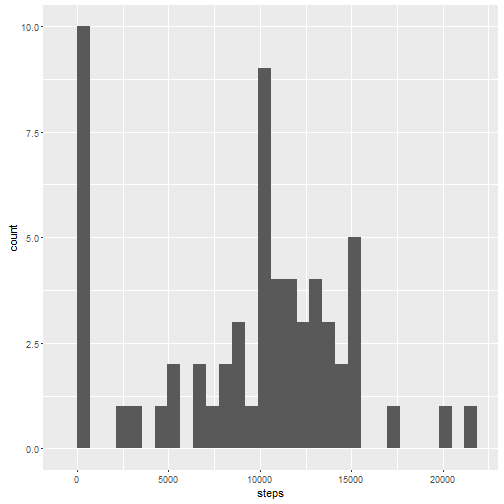
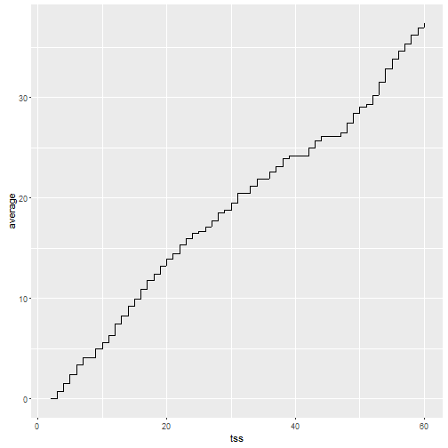
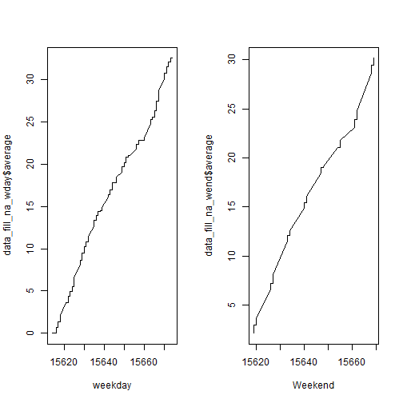

##Loading and preprocessing the data


Load the data 

```r
data<-read.csv("activity.csv")
```


Save a copy of data that have no NAs


```r
data_no_NAs<-na.omit(data)
```


##What is mean total number of steps taken per day?


For this part of the assignment, you can ignore the missing values in the dataset.

1.Calculate the total number of steps taken per day


```r
steps<-NULL

for ( i in levels(data[,2]))

        {
          steps[i]<-sum(data_no_NAs[data_no_NAs[,2]==i,1])
            
        }


steps<-data.frame(steps)

t(steps)
```

```
##       2012-10-01 2012-10-02 2012-10-03 2012-10-04 2012-10-05 2012-10-06
## steps          0        126      11352      12116      13294      15420
##       2012-10-07 2012-10-08 2012-10-09 2012-10-10 2012-10-11 2012-10-12
## steps      11015          0      12811       9900      10304      17382
##       2012-10-13 2012-10-14 2012-10-15 2012-10-16 2012-10-17 2012-10-18
## steps      12426      15098      10139      15084      13452      10056
##       2012-10-19 2012-10-20 2012-10-21 2012-10-22 2012-10-23 2012-10-24
## steps      11829      10395       8821      13460       8918       8355
##       2012-10-25 2012-10-26 2012-10-27 2012-10-28 2012-10-29 2012-10-30
## steps       2492       6778      10119      11458       5018       9819
##       2012-10-31 2012-11-01 2012-11-02 2012-11-03 2012-11-04 2012-11-05
## steps      15414          0      10600      10571          0      10439
##       2012-11-06 2012-11-07 2012-11-08 2012-11-09 2012-11-10 2012-11-11
## steps       8334      12883       3219          0          0      12608
##       2012-11-12 2012-11-13 2012-11-14 2012-11-15 2012-11-16 2012-11-17
## steps      10765       7336          0         41       5441      14339
##       2012-11-18 2012-11-19 2012-11-20 2012-11-21 2012-11-22 2012-11-23
## steps      15110       8841       4472      12787      20427      21194
##       2012-11-24 2012-11-25 2012-11-26 2012-11-27 2012-11-28 2012-11-29
## steps      14478      11834      11162      13646      10183       7047
##       2012-11-30
## steps          0
```

```r
steps<-cbind(steps,"Date"=rownames(steps))

names(steps[,2])<-"Date"
```


2.Make a histogram of the total number of steps taken each day


```r
library(ggplot2)

p<- ggplot(steps,aes(steps)) + geom_histogram()

p
```

```
## `stat_bin()` using `bins = 30`. Pick better value with `binwidth`.
```




3.Calculate and report the mean and median of the total number of steps taken per day


Mean 

```r
mean_steps<- NULL

for ( i in levels(data[,2]))

        {
          mean_steps[i]<-mean(data_no_NAs[data_no_NAs[,2]==i,1])
            
        }

mean_steps<-data.frame(mean_steps)

t(mean_steps)
```

```
##            2012-10-01 2012-10-02 2012-10-03 2012-10-04 2012-10-05
## mean_steps        NaN     0.4375   39.41667   42.06944   46.15972
##            2012-10-06 2012-10-07 2012-10-08 2012-10-09 2012-10-10
## mean_steps   53.54167   38.24653        NaN   44.48264     34.375
##            2012-10-11 2012-10-12 2012-10-13 2012-10-14 2012-10-15
## mean_steps   35.77778   60.35417   43.14583   52.42361   35.20486
##            2012-10-16 2012-10-17 2012-10-18 2012-10-19 2012-10-20
## mean_steps     52.375   46.70833   34.91667   41.07292   36.09375
##            2012-10-21 2012-10-22 2012-10-23 2012-10-24 2012-10-25
## mean_steps   30.62847   46.73611   30.96528   29.01042   8.652778
##            2012-10-26 2012-10-27 2012-10-28 2012-10-29 2012-10-30
## mean_steps   23.53472   35.13542   39.78472   17.42361   34.09375
##            2012-10-31 2012-11-01 2012-11-02 2012-11-03 2012-11-04
## mean_steps   53.52083        NaN   36.80556   36.70486        NaN
##            2012-11-05 2012-11-06 2012-11-07 2012-11-08 2012-11-09
## mean_steps   36.24653    28.9375   44.73264   11.17708        NaN
##            2012-11-10 2012-11-11 2012-11-12 2012-11-13 2012-11-14
## mean_steps        NaN   43.77778   37.37847   25.47222        NaN
##            2012-11-15 2012-11-16 2012-11-17 2012-11-18 2012-11-19
## mean_steps  0.1423611   18.89236   49.78819   52.46528   30.69792
##            2012-11-20 2012-11-21 2012-11-22 2012-11-23 2012-11-24
## mean_steps   15.52778   44.39931   70.92708   73.59028   50.27083
##            2012-11-25 2012-11-26 2012-11-27 2012-11-28 2012-11-29
## mean_steps   41.09028   38.75694   47.38194   35.35764   24.46875
##            2012-11-30
## mean_steps        NaN
```


Median

```r
median_steps<- NULL

for ( i in levels(data[,2]))

        {
          median_steps[i]<-median(data_no_NAs[data_no_NAs[,2]==i,1])
            
        }

median_steps<-data.frame(mean_steps)

t(median_steps)
```

```
##            2012-10-01 2012-10-02 2012-10-03 2012-10-04 2012-10-05
## mean_steps        NaN     0.4375   39.41667   42.06944   46.15972
##            2012-10-06 2012-10-07 2012-10-08 2012-10-09 2012-10-10
## mean_steps   53.54167   38.24653        NaN   44.48264     34.375
##            2012-10-11 2012-10-12 2012-10-13 2012-10-14 2012-10-15
## mean_steps   35.77778   60.35417   43.14583   52.42361   35.20486
##            2012-10-16 2012-10-17 2012-10-18 2012-10-19 2012-10-20
## mean_steps     52.375   46.70833   34.91667   41.07292   36.09375
##            2012-10-21 2012-10-22 2012-10-23 2012-10-24 2012-10-25
## mean_steps   30.62847   46.73611   30.96528   29.01042   8.652778
##            2012-10-26 2012-10-27 2012-10-28 2012-10-29 2012-10-30
## mean_steps   23.53472   35.13542   39.78472   17.42361   34.09375
##            2012-10-31 2012-11-01 2012-11-02 2012-11-03 2012-11-04
## mean_steps   53.52083        NaN   36.80556   36.70486        NaN
##            2012-11-05 2012-11-06 2012-11-07 2012-11-08 2012-11-09
## mean_steps   36.24653    28.9375   44.73264   11.17708        NaN
##            2012-11-10 2012-11-11 2012-11-12 2012-11-13 2012-11-14
## mean_steps        NaN   43.77778   37.37847   25.47222        NaN
##            2012-11-15 2012-11-16 2012-11-17 2012-11-18 2012-11-19
## mean_steps  0.1423611   18.89236   49.78819   52.46528   30.69792
##            2012-11-20 2012-11-21 2012-11-22 2012-11-23 2012-11-24
## mean_steps   15.52778   44.39931   70.92708   73.59028   50.27083
##            2012-11-25 2012-11-26 2012-11-27 2012-11-28 2012-11-29
## mean_steps   41.09028   38.75694   47.38194   35.35764   24.46875
##            2012-11-30
## mean_steps        NaN
```


##What is the average daily activity pattern?

1.Make a time series plot (i.e. type = "l") of the 5-minute interval (x-axis) and the average number of steps taken, averaged across all days (y-axis)


```r
average<- cumsum(data_no_NAs[,1])/nrow(data_no_NAs)


data_timeseries<-cbind(data_no_NAs,average)

tss=ts(data_timeseries$date)

ggplot(data_timeseries, aes(tss, average)) + geom_line()
```

```
## Don't know how to automatically pick scale for object of type ts. Defaulting to continuous
```




2.Which 5-minute interval, on average across all the days in the dataset, contains the maximum number of steps?


```r
max_steps<-max(data_no_NAs[,1])

rownames(data_no_NAs[data_no_NAs[,1]==max_steps,])
```

```
## [1] "16492"
```
The above number of row contains the maximun number of steps.


##Imputing missing values

Note that there are a number of days/intervals where there are missing values (coded as NA). The presence of missing days may introduce bias into some calculations or summaries of the data.


1.Calculate and report the total number of missing values in the dataset (i.e. the total number of rows with NAs)


```r
na_number <- nrow(data[is.na(data),])

na_number
```

```
## [1] 2304
```


2.Devise a strategy for filling in all of the missing values in the dataset. The strategy does not need to be sophisticated. For example, you could use the mean/median for that day, or the mean for that 5-minute interval, etc.

Use the mean of that interval to fill in NAs

```r
mean_interval<- NULL


for (i in levels(as.factor(data[,3])))
     
     {
  
        mean_interval[i]<-  mean(data[data[,3]==i,1],na.rm = TRUE)
     
     
     }


for (i in 1: nrow(data))

              {
                 if (is.na(data[i,1])) 
                      {
                          
                          get_date <- data[i,2]
                   
                          data[i,1]<-mean_interval[get_date]
                    
                      }
                  
  
              }
```


2.Create a new dataset that is equal to the original dataset but with the missing data filled in.


```r
data_fill_na <-data
```


3.Make a histogram of the total number of steps taken each day and Calculate and report the mean and median total number of steps taken per day. Do these values differ from the estimates from the first part of the assignment? What is the impact of imputing missing data on the estimates of the total daily number of steps?


Histogram

```r
steps<-NULL

for ( i in levels(data[,2]))

        {
          steps[i]<-sum(data_fill_na[data_fill_na[,2]==i,1])
            
        }


steps<-data.frame(steps)


library(ggplot2)

p<- ggplot(steps,aes(steps)) + geom_histogram()

p
```

```
## `stat_bin()` using `bins = 30`. Pick better value with `binwidth`.
```


Mean 

```r
mean_steps<- NULL

for ( i in levels(data_fill_na[,2]))

        {
          mean_steps[i]<-mean(data_fill_na[data_fill_na[,2]==i,1])
            
        }

mean_steps<-data.frame(mean_steps)

t(mean_steps)
```

```
##            2012-10-01 2012-10-02 2012-10-03 2012-10-04 2012-10-05
## mean_steps   1.716981     0.4375   39.41667   42.06944   46.15972
##            2012-10-06 2012-10-07 2012-10-08 2012-10-09 2012-10-10
## mean_steps   53.54167   38.24653  0.8679245   44.48264     34.375
##            2012-10-11 2012-10-12 2012-10-13 2012-10-14 2012-10-15
## mean_steps   35.77778   60.35417   43.14583   52.42361   35.20486
##            2012-10-16 2012-10-17 2012-10-18 2012-10-19 2012-10-20
## mean_steps     52.375   46.70833   34.91667   41.07292   36.09375
##            2012-10-21 2012-10-22 2012-10-23 2012-10-24 2012-10-25
## mean_steps   30.62847   46.73611   30.96528   29.01042   8.652778
##            2012-10-26 2012-10-27 2012-10-28 2012-10-29 2012-10-30
## mean_steps   23.53472   35.13542   39.78472   17.42361   34.09375
##            2012-10-31 2012-11-01 2012-11-02 2012-11-03 2012-11-04
## mean_steps   53.52083  0.2264151   36.80556   36.70486    1.54717
##            2012-11-05 2012-11-06 2012-11-07 2012-11-08 2012-11-09
## mean_steps   36.24653    28.9375   44.73264   11.17708          0
##            2012-11-10 2012-11-11 2012-11-12 2012-11-13 2012-11-14
## mean_steps  0.2075472   43.77778   37.37847   25.47222   0.490566
##            2012-11-15 2012-11-16 2012-11-17 2012-11-18 2012-11-19
## mean_steps  0.1423611   18.89236   49.78819   52.46528   30.69792
##            2012-11-20 2012-11-21 2012-11-22 2012-11-23 2012-11-24
## mean_steps   15.52778   44.39931   70.92708   73.59028   50.27083
##            2012-11-25 2012-11-26 2012-11-27 2012-11-28 2012-11-29
## mean_steps   41.09028   38.75694   47.38194   35.35764   24.46875
##            2012-11-30
## mean_steps          0
```


Median

```r
median_steps<- NULL

for ( i in levels(data_fill_na[,2]))

        {
          median_steps[i]<-median(data_fill_na[data_fill_na[,2]==i,1])
            
        }

median_steps<-data.frame(mean_steps)

t(median_steps)
```

```
##            2012-10-01 2012-10-02 2012-10-03 2012-10-04 2012-10-05
## mean_steps   1.716981     0.4375   39.41667   42.06944   46.15972
##            2012-10-06 2012-10-07 2012-10-08 2012-10-09 2012-10-10
## mean_steps   53.54167   38.24653  0.8679245   44.48264     34.375
##            2012-10-11 2012-10-12 2012-10-13 2012-10-14 2012-10-15
## mean_steps   35.77778   60.35417   43.14583   52.42361   35.20486
##            2012-10-16 2012-10-17 2012-10-18 2012-10-19 2012-10-20
## mean_steps     52.375   46.70833   34.91667   41.07292   36.09375
##            2012-10-21 2012-10-22 2012-10-23 2012-10-24 2012-10-25
## mean_steps   30.62847   46.73611   30.96528   29.01042   8.652778
##            2012-10-26 2012-10-27 2012-10-28 2012-10-29 2012-10-30
## mean_steps   23.53472   35.13542   39.78472   17.42361   34.09375
##            2012-10-31 2012-11-01 2012-11-02 2012-11-03 2012-11-04
## mean_steps   53.52083  0.2264151   36.80556   36.70486    1.54717
##            2012-11-05 2012-11-06 2012-11-07 2012-11-08 2012-11-09
## mean_steps   36.24653    28.9375   44.73264   11.17708          0
##            2012-11-10 2012-11-11 2012-11-12 2012-11-13 2012-11-14
## mean_steps  0.2075472   43.77778   37.37847   25.47222   0.490566
##            2012-11-15 2012-11-16 2012-11-17 2012-11-18 2012-11-19
## mean_steps  0.1423611   18.89236   49.78819   52.46528   30.69792
##            2012-11-20 2012-11-21 2012-11-22 2012-11-23 2012-11-24
## mean_steps   15.52778   44.39931   70.92708   73.59028   50.27083
##            2012-11-25 2012-11-26 2012-11-27 2012-11-28 2012-11-29
## mean_steps   41.09028   38.75694   47.38194   35.35764   24.46875
##            2012-11-30
## mean_steps          0
```

Compared with the first part, they are basically the same.


##Are there differences in activity patterns between weekdays and weekends?


4.For this part the weekdays() function may be of some help here. Use the dataset with the filled-in missing values for this part.

Create a new factor variable in the dataset with two levels ¨C ¡°weekday¡± and ¡°weekend¡± indicating whether a given date is a weekday or weekend day.


```r
library(timeDate)


data_fill_na[,4]<-NULL

data_fill_na[,2]<- as.Date(data_fill_na[,2])

for (i in 1:nrow(data_fill_na))
  
      {
          if (isWeekday(data_fill_na[i,2]))
             
          {
            
            data_fill_na[i,4]<-"weekday"
            
          }

             
             else
               
               data_fill_na[i,4]<-"weekend"
  
  
}

data_fill_na[,4]<-as.factor(data_fill_na[,4])
```


5.Make a panel plot containing a time series plot (i.e. type = "l") of the 5-minute interval (x-axis) and the average number of steps taken, averaged across all weekday days or weekend days (y-axis). See the README file in the GitHub repository to see an example of what this plot should look like using simulated data.


```r
par(mfrow=c(2,1))

average<- cumsum(data_fill_na[,1])/nrow(data_fill_na)


data_fill_na<-cbind(data_fill_na,average)

data_fill_na_wday <- data_fill_na[data_fill_na[,4]=="weekday",]
  
weekday=ts(data_fill_na_wday$date)


plot(weekday,data_fill_na_wday$average, type="l")


data_fill_na_wend <- data_fill_na[data_fill_na[,4]=="weekend",]
  
Weekend=ts(data_fill_na_wend$date)


plot(Weekend,data_fill_na_wend$average, type="l")
```



